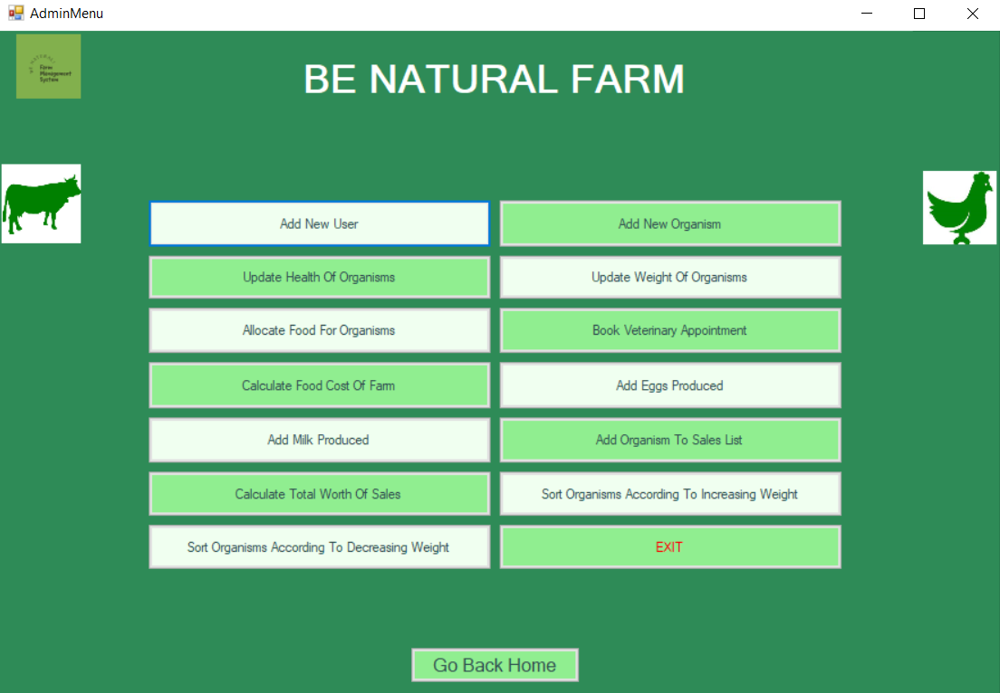
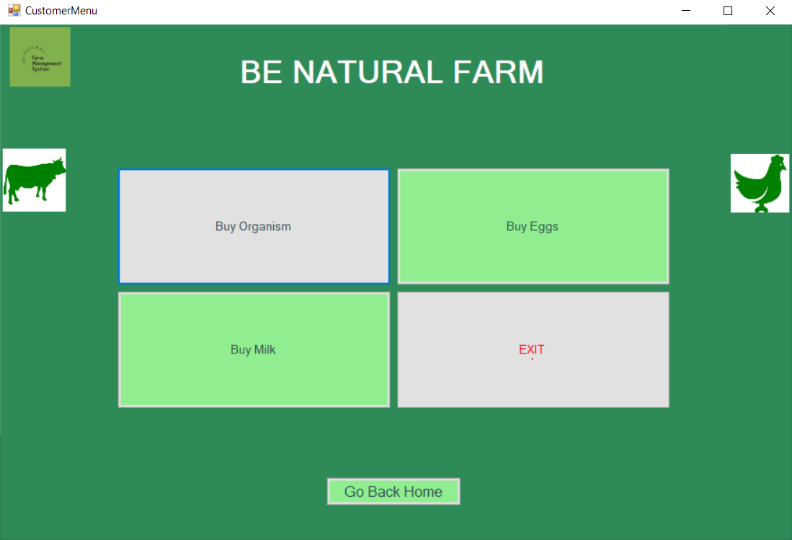

# Farm Management System (Be Natural Farm)

This repository contains work originally developed in April-May 2022. The commits are dated according to the original work timeline, but the repository was created on 29th August, 2024 for organizational and archival purposes.

## Overview

The Farm Management System (Be Natural Farm) is a Windows Forms application developed in C# as a final project for the Object-Oriented Programming course. It provides a user-friendly interface for managing farm operations, including tracking and selling farm products and organisms. The system allows administrators to add items such as eggs and milk, put organisms (animals and birds) on sale, update organisms' health and weight, and view organisms sorted by weight. Customers can also make purchases from the system.

## Features

Some of the main features are:

- **Admin Panel:**
  - Add and manage farm products (e.g., eggs, milk).
  - Put animals and birds on sale.
  - Update organisms' health and weight.
  - View organisms in increasing and decreasing order of weight.
  - Track inventory and sales.

- **Customer Interface:**
  - View available products and organisms.
  - Purchase items and organisms.

## Screenshots

### Admin Panel

### Customer Interface

